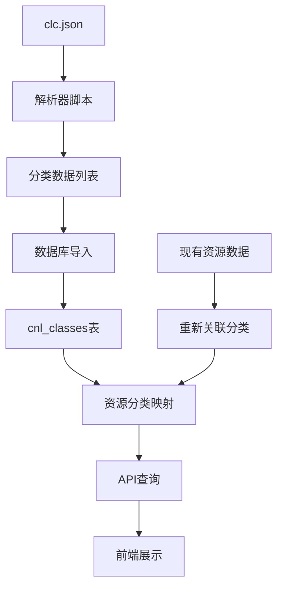

# 基于clc.json的中图分类体系更新实施计划

## 项目概述
根据`scripts/get_cnl_classification/clc.json`文件的标准分类体系，更新FastapiMirrorSite项目的图书资源分类系统，实现完整、准确的中国图书馆分类法（中图法）支持。与之前基于"海纳中图分类.txt"的解析不同，clc.json提供了结构化的JSON数据，避免了不标准分类代码的解析问题。

## 当前状态分析

### 现有分类系统（简化版）
- **分类数量**：约200个分类（来自`app/cnl_classifications.py`）
- **层级深度**：最多3级
- **数据来源**：手动定义的简化分类
- **问题**：分类不完整，层级关系简化

### clc.json分类系统（完整中图法）
- **数据结构**：JSON格式，嵌套层级结构
- **分类数量**：约200,000行JSON（估计数千个分类）
- **层级深度**：最多4-5级
- **分类代码**：标准中图法代码（如A221.1, B0-0等）
- **优势**：结构规范，层级关系明确，无需复杂解析

## 更新目标
1. **导入完整的clc.json分类体系**到数据库
2. **建立正确的层级关系**（parent-child）
3. **清空现有分类数据**，完全重新导入
4. **保持系统API兼容性**
5. **验证数据完整性**和层级关系正确性

## 技术架构

### 数据流图


### 数据库模型
当前`CnlClass`模型已支持层级关系：
- `id`: 主键
- `code`: 分类代码（唯一）
- `name`: 分类名称
- `parent_id`: 父分类ID
- `level`: 层级（1-5）
- `path`: 分类路径

## 实施步骤

### 阶段一：解析器开发
1. **创建clc.json解析器** (`scripts/parse_clc_json.py`)
   - 读取JSON文件
   - 递归遍历嵌套结构
   - 提取分类代码(`id`)和描述(`desc`)
   - 计算层级关系(`level`)
   - 生成父分类引用(`parent_code`)

2. **数据结构转换**
   - 将嵌套JSON转换为扁平列表
   - 格式：`(code, name, parent_code, level)`
   - 生成`CLASS_DEFS`列表

3. **权重分配方案**
   - 基于分类层级和学科重要性
   - 为常用分类分配较高权重
   - 生成`GEN_CLASS_WEIGHTS`字典

### 阶段二：种子数据更新
1. **更新`app/cnl_classifications.py`**
   - 替换现有的`CLASS_DEFS`定义
   - 更新`GEN_CLASS_WEIGHTS`权重表
   - 确保数据格式兼容

2. **创建新的种子数据脚本** (`app/seed_data_clc.py`)
   - 基于clc.json的分类数据
   - 支持清空现有数据选项
   - 包含数据验证逻辑

3. **资源数据重新关联**
   - 更新资源生成逻辑
   - 确保资源分布到适当的分类
   - 维护资源-分类映射关系

### 阶段三：数据库更新
1. **数据清理策略**
   ```sql
   -- 清空现有分类数据（级联删除）
   DELETE FROM resource_class_map;
   DELETE FROM cnl_classes;
   ```

2. **分类数据导入**
   - 运行新的种子数据脚本
   - 验证分类数量
   - 检查层级关系完整性

3. **资源数据更新**
   - 重新生成或更新资源分类映射
   - 验证映射关系正确性

### 阶段四：测试验证
1. **分类数据测试**
   - 验证分类数量是否符合预期
   - 检查层级关系正确性
   - 测试路径字段计算

2. **API兼容性测试**
   - 验证现有API端点正常工作
   - 测试分类树形结构返回
   - 检查前端页面显示

3. **性能测试**
   - 分类查询性能
   - 树形结构构建效率
   - 资源检索速度

## 技术细节

### clc.json解析算法
```python
def parse_clc_json(json_data, parent_code=None, level=1):
    """递归解析clc.json嵌套结构"""
    classifications = []
    
    for item in json_data:
        code = item["id"]
        name = item["desc"]
        
        # 添加当前分类
        classifications.append((code, name, parent_code, level))
        
        # 递归处理子分类
        if "children" in item:
            child_classifications = parse_clc_json(
                item["children"], 
                parent_code=code, 
                level=level + 1
            )
            classifications.extend(child_classifications)
    
    return classifications
```

### 权重分配策略
1. **一级分类**：基础权重10
2. **常用学科分类**：额外权重加成
3. **深度层级分类**：适当降低权重
4. **特殊分类**：根据实际需求调整

### 数据验证规则
1. **分类代码唯一性**：确保没有重复代码
2. **父分类存在性**：所有parent_code必须对应有效分类
3. **层级连续性**：层级值必须连续递增
4. **路径正确性**：path字段正确反映分类路径

## 风险与缓解措施

### 风险1：数据量过大
- **风险**：clc.json包含大量分类，可能影响性能
- **缓解**：分批导入，添加索引优化

### 风险2：层级关系错误
- **风险**：JSON结构可能存在不一致
- **缓解**：添加数据验证和修复逻辑

### 风险3：API兼容性
- **风险**：分类结构变化可能影响现有API
- **缓解**：保持API接口不变，内部数据结构优化

### 风险4：资源数据丢失
- **风险**：清空分类数据可能导致资源关联丢失
- **缓解**：备份现有数据，提供恢复机制

## 交付物
1. **解析器脚本**：`scripts/parse_clc_json.py`
2. **更新后的分类定义**：`app/cnl_classifications.py`
3. **新的种子数据脚本**：`app/seed_data_clc.py`
4. **测试脚本**：`tests/test_clc_classifications.py`
5. **文档**：更新后的API文档和分类体系说明

## 成功标准
1. ✅ 完整导入clc.json中的所有分类
2. ✅ 层级关系正确建立
3. ✅ 现有API保持兼容
4. ✅ 资源数据正确关联
5. ✅ 系统性能符合要求

## 后续优化建议
1. **分类缓存**：实现分类树形结构缓存
2. **搜索优化**：添加分类搜索功能
3. **统计功能**：分类资源数量统计
4. **可视化**：分类体系可视化展示